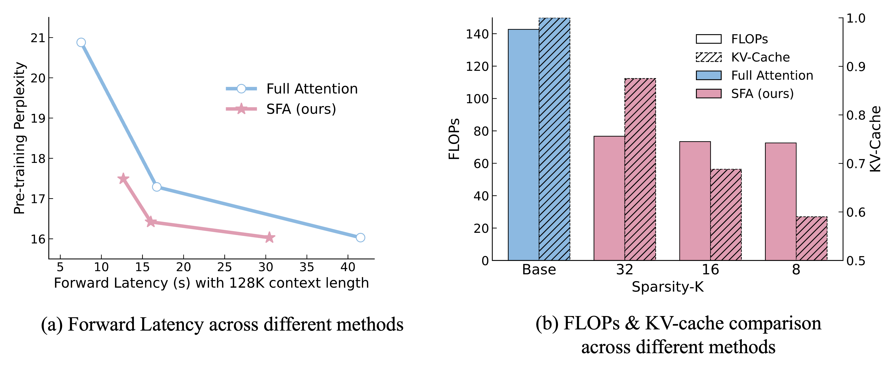
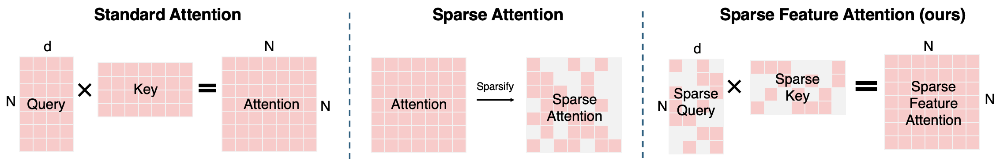

# Scaling Attention via Feature Sparsity

[](https://iclr.cc/) [](https://claude.ai/chat/LICENSE)

> **Scaling Attention via Feature Sparsity**
>  Yan Xie*, Tiansheng Wen*, Tangda Huang, Bo Chen†, Chenyu You, Stefanie Jegelka, Yifei Wang†
>  *Equal Contribution · †Corresponding Authors
>  Published at ICLR 2026

------

## Overview



We propose **Sparse Feature Attention (SFA)**, a drop-in replacement for multi-head self-attention that operates along the **feature axis** rather than the token axis. Each query/key vector is sparsified to its top-*k* active dimensions, reducing the cost of attention from $\Theta(n^2d)$ to $\Theta\left(\frac{n^2 k^2}{d}\right)$— a $\left(\frac{k}{d}\right)^2$ fraction of the dense cost — while preserving full token coverage and exact softmax semantics.

We also introduce **FlashSFA**, an IO-aware CUDA kernel that extends FlashAttention to operate directly on sparse feature overlaps without ever materializing the $n \times n$ score matrix.

**Key results:**

- Up to **2.5× end-to-end speedup** over dense attention at 128k context
- **~50% reduction** in FLOPs and KV-cache memory
- Matches dense baselines on GPT-2 and Qwen3 pretraining perplexity and downstream accuracy
- Fully **orthogonal and composable** with token-level sparsity methods (Longformer, NSA, SnapKV, etc.)

## Method



Attention scores are computed **only over overlapping active coordinates** between each query–key pair, using sparse matrix multiplication (SpGEMM) in CSR/CSC format.

## TODO

Code release is in progress. The following components are planned:

### Core Implementation

- [ ] SFA attention module
- [ ] FlashSFA CUDA kernel

### Training

- [x] GPT-2 pretraining script with SFA 
- [ ] Qwen3 pretraining script with SFA 
- [ ] SFA fine-tuning script with MSE regularization loss (Eq. 8) 

### Evaluation

- [ ] Perplexity evaluation (OpenWebText / Pile) 
- [ ] Zero-shot downstream benchmarks (PiQA, LAMBADA, ARC, HellaSwag) 
- [ ] Needle-in-a-Haystack (NIAH) synthetic retrieval benchmark 
- [ ] GSM-8K, Arxiv, PubMed fine-tuning evaluation 

### Efficiency Benchmarks

- [ ] Latency benchmarking script (vs. FlashAttention-2) 

### Pretrained Checkpoints

- [ ] GPT-2 Small + SFA (k=8) 
- [ ] GPT-2 Medium + SFA (k=8) 
- [ ] Qwen3-0.6B + SFA (k=16) 

## Citation

If you find this work useful, please cite:

```bibtex
@inproceedings{xie2026sfa,
  title     = {Scaling Attention via Feature Sparsity},
  author    = {Xie, Yan and Wen, Tiansheng and Huang, Tangda and Chen, Bo and You, Chenyu and Jegelka, Stefanie and Wang, Yifei},
  booktitle = {International Conference on Learning Representations (ICLR)},
  year      = {2026}
}
```

------

## Acknowledgements

This work was supported by Xidian University, Stony Brook University, TUM, MIT, and Amazon AGI SF Lab. We thank the authors of [FlashAttention](https://github.com/Dao-AILab/flash-attention) and [LeetCUDA](https://github.com/xlite-dev/LeetCUDA) whose codebases informed our kernel implementation. Our GPT-2 pretraining code builds on [nanoGPT](https://github.com/karpathy/nanoGPT) and our Qwen3 pretraining code builds on [LLaMA-Factory](https://github.com/hiyouga/LLaMA-Factory).